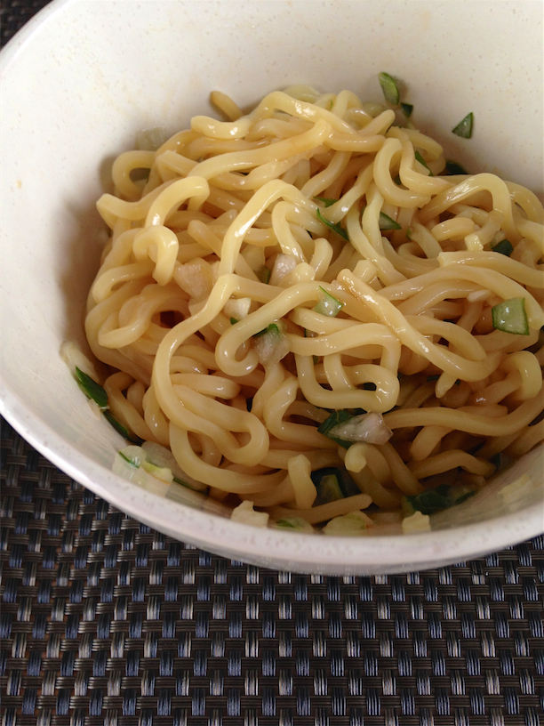
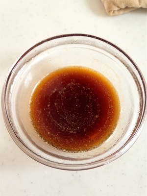
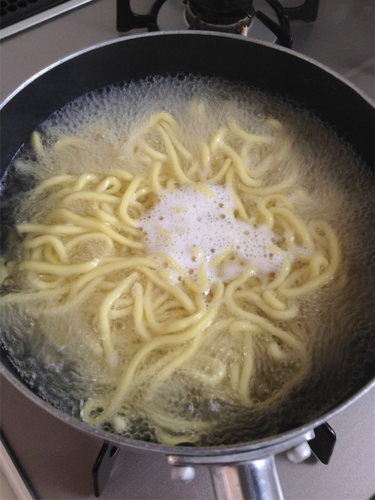
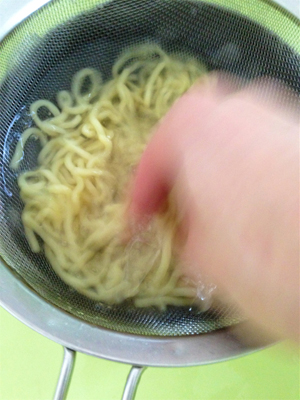

# AburaSoba - 油そば

## 材料

1人前

- 中華太麺　1玉
- ねぎ 適量
- 玉ねぎ 1/4玉
- たれ
  - うすくち醤油      小さじ1
  - オイスターソース  小さじ1
  - ごま油            小さじ1
  - 日本酒            小さじ1
  - 酢                小さじ1
  - 粉末鶏ガラスープの素 or 味覇   小さじ1/2
  - ラー油 小さじ1/2

## 作り方

1. 玉ねぎをみじん切りにして水につけて辛味をとっておく。
2. たれを混ぜてレンジ(600W)で20秒チンする。

3. たれを器にうつす。
4. 中華麺を茹でる。

5. 茹でた中華麺をザルにあげて冷水 or 氷水でよく洗ってしめる。

6. 洗った中華麺の水気をよくきってたれの入った器に入れる。
7. 水をきった玉ねぎとねぎを盛りつけて完成。

## ポイント

- 中華麺は氷水で洗ってぬめりをとってよくしめる。
- タレをチンしてから混ぜた方が味覇がちゃんと溶けて美味しい。
- お酢とラー油はあとからぐるっと回すようにお好みでかけるのがおすすめ。
