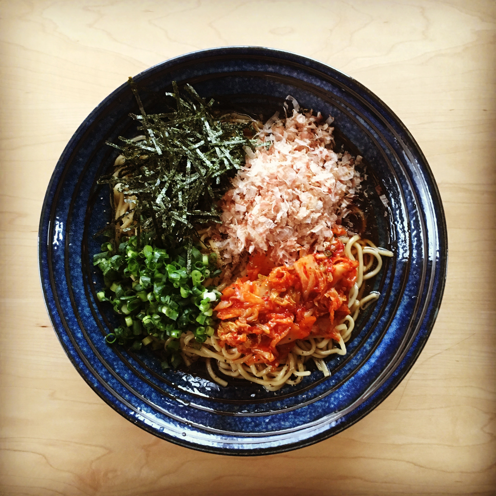

#  油そば - AburaSoba

## 材料

1人前

- 中華太麺　1玉
- タレ(ベースとなるもの)
  - ごま油 大さじ 1
  - にんにく(すりおろし) 小さじ 1/2
  - 鶏ガラスープの素 小さじ 1/2
  - 砂糖 少々
  - オイスターソース 大さじ 1
  - だし醤油 大さじ 1
  - 穀物酢 大さじ 1
  - コチュジャン 小さじ 1/2
  - 味の素 少々
- タレに混ぜる粉末
  - 煎りゴマ少々
  - 花椒粉 少々
- 麺とタレを混ぜたあとにふりかける
  - 粗引き黒胡椒 少々
- トッピングに必須なもの
  - 鰹節(花けずり)
- お好みでかけるもの
  - ラー油

## 作り方

#### タレをつくる

タレのベースになるものを混ぜる。混ぜたらレンジで30秒程あたため、すべてをよく混ぜきる。

#### タレに混ぜる粉末を擦る

いりゴマと花椒粉をひとつまみずつすり鉢に入れて荒めに擦る。

#### 麺を茹でる

沸騰したお湯に麺を入れて茹でる

#### 盛り付ける

- 器にタレを入れてその上に粉末を入れる。
- 茹で上がった麺を湯切りして、暖かい麺をタレの入った器に入れてよく混ぜる。
- 麺に粗挽きの黒胡椒をふりかけてその上に鰹節(花けずり)をトッピングして完成。

## PDCA

- 醤油だれは今回だし醤油を使ったが改善の余地がかなりある。次回は濃い口とうすくちを割ったもので試してみたいと思う。
- 花椒粉は粉末状のものではなく、実のものを買って自分で擦った方が良いと思う。
- ヌードルメーカー欲しい。
